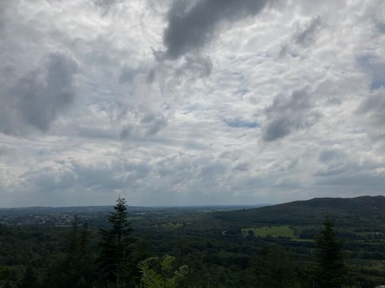

## Union Rock and Cats

It's a Bank Holiday here in Ireland. The weather has been cloudy and wet. A sun break rolled in this afternoon so we headed out for a nice walk. We are currently in Sligo caring for Rory the cat. There are two strays that are coming around. We have named them Sparkles and Sparky. They are almost identical. Both sweet cats. Sparky is currently lounging on the couch while Rory cleans herself. Domestic bliss.

I digress. We headed to Union Rock this afternoon. The sun was out and the temperature was that nice warm. Not sweaty hot. I love Irish summers. Luke warm and a bit damp. Google Maps led us on a merry dance to the spot we were heading to. After a couple of u-turns and a false start to the walk we found the parking lot we were looking for.

Union Rock is a fifteen minute drive from Sligo and the park surrounding it is lovely. The hike is mellow and takes about 40 minutes at our pace. You wander through woods on a gravel trail slowly winding your way to the top. The view overlooks the coast and a lake. It is a good place to find yourself. The English put a cannon up there and fired at the Irish and French rebels.

I would elaborate more but I am knackered. I want to write something everyday. So this is it. Stayed up far too late last night. Worked on my Murrisk story. That was fun. I am tired. Good night.

Bish. Bosh. Bang. Sorted. Have a lovely digital day.

- [Union Rock](https://sligowalks.ie/walks/union-wood/)

