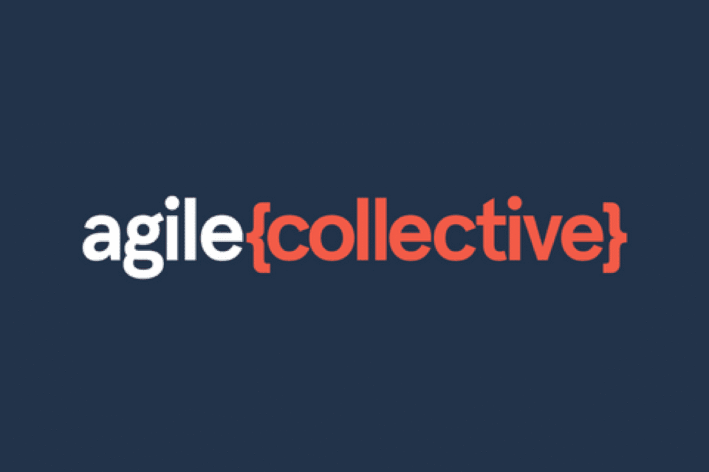
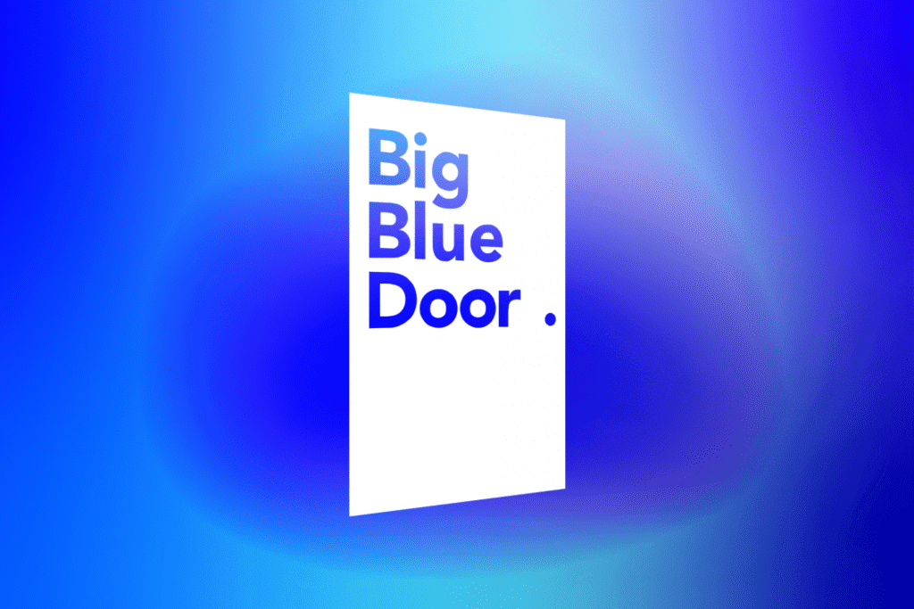

What a week! I have to admit, I went into **[LocalGov Drupal Week](https://localgovdrupal.org/community/community-events/localgov-drupal-week)** thinking I'd dip into one or two sessions and ended up attending them all! Seriously, five days, three online sessions a day, covering everything from the deep-dive tech of **AI** to the ever-important topic of **Bin Schedules** (a council website staple!).

My main takeaway? The **[LocalGov Drupal](https://localgovdrupal.org/) (LGD) community is absolutely alive and kicking.**

### A Wave of Collaboration and Hope

At a time when you hear so much about agencies struggling and layoffs in the tech world, this corner of the Drupal universe is pulling in the opposite direction. It was a genuine highlight to witness the sheer **passion and collaborative energy** in every session.

- **Attendance was through the roof!** Seeing over a hundred participants in some sessions, all genuinely engaged and firing off questions, was truly impressive.

- **It’s more than just a CMS.** It's humbling to see the amount of time, energy, and shared knowledge poured into LGD. It's not just about a tech stack; it’s about making local government services work better for everyone. That shared goal is what brings people from all councils and agencies to the table.

I came away with a huge sense of **hope** and am genuinely excited about the direction of travel!

* * *

### The Top Three that Blew Me Away

While I found something valuable in every single talk, three sessions really stuck with me, offering a powerful glimpse into the future of LocalGov digital:

#### 1\. Designing for LocalGov Drupal

This session, presented by **[Mark Conroy](https://the-confident.com/)**, was excellent. His walkthrough was clear, and the **honesty around his workflow** made the whole talk feel authentic and incredibly useful. Plus, he managed to work in a **Manic Street Preachers reference,** which was impressive!

It was a brilliant look at how to approach a new LGD project, emphasising that **good design makes content creators' lives better** when done properly. This was a great example of effective project planning and development. A fantastic session for anyone planning a project, stressing the importance of learning from others, solid **planning and timing**, working with good vendors, and excellent training. Mark's upcoming [course](https://the-confident.com/courses/build-a-localgov-drupal-website/) should definitely be worth checking out.

#### 2\. Transforming How We Publish: The PDF Importer Project at Southwark Council

PDFs are the bane of every council website, but [Southwark](https://www.southwark.gov.uk/) is tackling this head-on! This was a great showcase of finding **innovation** and moving towards better data management. It’s inspiring to see councils taking on these kinds of challenging projects that will ultimately improve service quality and accessibility for their residents.

#### 3\. AI Insights for Local Authority Websites: Lessons from 400 Council Websites

This was a phenomenal example of using digital insight for good. The [team](https://www.digitaljourneycoach.com/) behind this dedicated significant time to pull this together. Looking at what **400 council websites** are doing gives us crucial, actionable lessons, and their reporting dashboard is a goldmine (check it out here: [https://council-insight.digitaljourneycoach.com/councils](https://council-insight.digitaljourneycoach.com/councils)). It showed the real potential of AI not just for trendy chatbots, but for genuine, data-driven service improvement.

* * *

### A Nod to the Future (and the Bins!)

The sessions sparked so many ideas and conversations about where LGD goes next. A few themes stood out:

- **The AI/Search/PDF Trinity:** People want to know more about AI chatbots, how to use them to read existing site PDFs for users, and how to constantly improve **search functionality**. We need to stay on top of this without losing sight of the core user experience.

- **The Power of Openness:** Seeing projects like **Open Referral** mentioned (for service finders powered by defined APIs) shows a clear path to **aggregation of data** and improving data quality across the board.

- **Measuring Success:** By focusing on **KPIs,** we can show that the fantastic work being done is actually _working_! Keep it measurable, keep it trackable.

- **And Yes, Bins are Big:** Council Tax and Bin Schedules are the content heavyweights. We need to keep making those services as slick and easy as possible, no matter how much 'buzzy' tech is floating around!

* * *

### A Massive Thank You!

This post wouldn't be complete without a huge shout-out:

- **To the LocalGov Team:** You orchestrated a brilliant week of informative, well-presented, and inspiring sessions. Thank you for making this community what it is.

- **To Every Presenter:** From the rapid prototyping tips to the deep-dive project insights, your willingness to share your hard work and knowledge is what truly makes LGD special.

- **To All the Participants:** Thank you for showing up, asking great questions, and demonstrating that the future of local government digital is in passionate and capable hands.

#### And Finally, a Heartfelt Thank You to the Sponsors!

See you at the next one! What was _your_ favourite session? Let me know in the comments!
